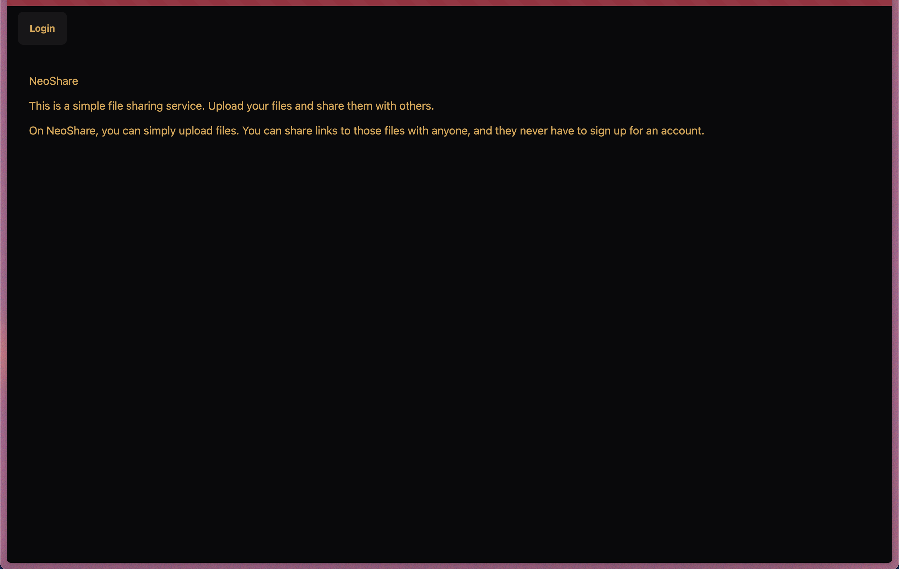
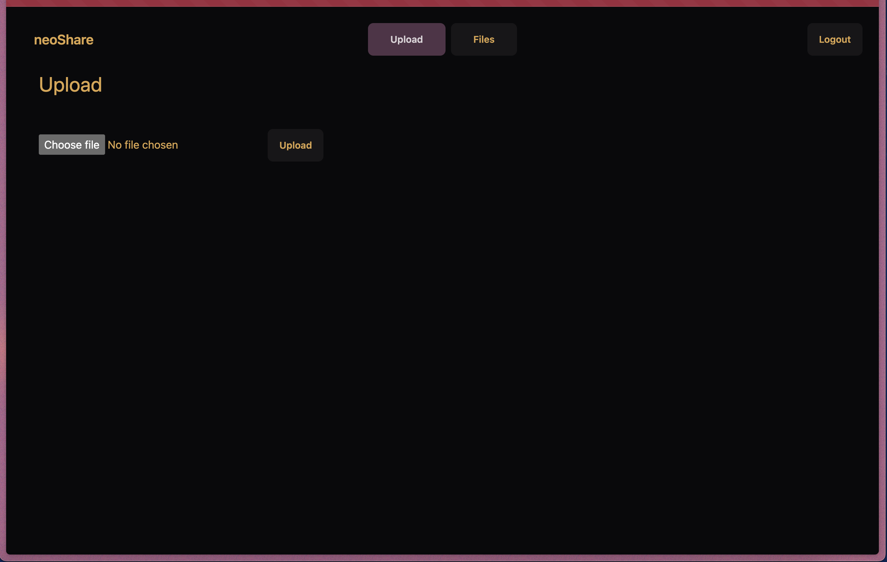

# 🤖 NeoShare

[](https://pkg.go.dev/github.com/gowebly/gowebly/v2)
[](https://goreportcard.com/report/github.com/XxThunderBlastxX/neoshare)
[](https://github.com/xxthunderblastxx/neoshare/releases/)
[](https://github.com/xxthunderblastxx/neoshare/blob/main/LICENCE)
[](https://gitpod.io/github.com/xxthunderblastxx/neoshare)

## 💡 Overview
NeoShare is a self-hosted hassle-free file sharing service with a single downloadable link.




## 🤔 Why NeoShare ?
There are many file sharing services available in the market, but none is like NeoShare.

- **Self Hosted** :- NeoShare is a self-hosted 👨‍💻 file sharing service, which means you have full control over your data 🔑.
- **Direct download link** :- NeoShare provides direct download link 🔗 to the files, which means you can share the link with anyone & they can download the file without requesting for any permission or login 😁.
- **No compression/resizing** :- NeoShare does not compress the files, which means the file you upload is the file you download 😉.
- **Open Source** :- NeoShare is open source, which means you can contribute to the project & make it better 🎉.

## 🛠️ Tech Stack
- [Go](https://go.dev)
- [Fiber](https://gofiber.io/)
- [HTMX](https://htmx.org)
- [HyperScript](https://hyperscript.org)
- [TailwindCSS](https://tailwindcss.com)
- [DaisyUI](https://daisyui.com)
- [Bun](https://bun.sh)
- [Postgres](https://www.postgresql.org)

## Environment Variables

- General Environment Variables

| Environment Variable | Meaning                                                                                                                |
|----------------------|------------------------------------------------------------------------------------------------------------------------|
| `PORT`               | TCP port on which to listen for HTTP connections. (default: `8080`)                                                    |
| `APP_ENV`            | It tells the program about the environment in which it is running. It can either take `dev` or `prod`. (default:`dev`) |
| `FAVICON_URI`        | Use this variable to customize the favicon by setting this variable with the favicon URI of your choice.               |

- S3 Environment Variables

| Environment Variable | Meaning                                                             |
|----------------------|---------------------------------------------------------------------|
| `S3_ENDPOINT`        | It is the endpoint at which your S3 Bucket is hosted.               |
| `S3_ACCESS_KEY`      | Access Key provided from your dashboard to access your S3 instance. |
| `S3_SECRET_KEY`      | Secret Key provided from your dashboard to access your S3 instance. |
| `S3_BUCKET`          | Name of the Bucket at which you want to store all your files.       |

- OIDC/Auth0 2.0 Auth Environment Variables

| Environment Variable        | Meaning                                                                                                                                                     |
|-----------------------------|-------------------------------------------------------------------------------------------------------------------------------------------------------------|
| `AUTH_CLIENT_ID`            | Client ID provided by your OIDC auth provider.                                                                                                              |
| `AUTH_CLIENT_SECRET`        | Client Secret provided by your OIDC auth provider.                                                                                                          |
| `AUTH_CALLBACK_URL`         | URL at which your application will comeback after successfully login.(default: `/callback`)                                                                 |
| `AUTH_DOMAIN`               | The Authentication domain of your auth provider, can be recived from your provider dashboard. **NOTE: Do provide the domain with `http://` or `https://`.** |
| `AUTH_AUDIENCE`             | Audience URL of your provider Auth API/Resource. (Required when you are using Auth0)                                                                        |
| `AUTH_USER_INFO_URL`        | URL to fetch User Info with a valid access token.                                                                                                           |
| `AUTH_LOGOUT_CALLBACK_URL`  | The route of the application at which the provider will callback after logging out from the application.                                                    |

- Postgres DB Environment Variables

| Environment Variable | Meaning                                                      |
|----------------------|--------------------------------------------------------------|
| `DB_DATABASE`        | Database name in your DB (default: neoshare).                |
| `DB_USERNAME`        | Username of your database.                                   |
| `DB_PASSWORD`        | Password of your database.                                   |
| `DB_PORT`            | Port at which the database would be running.(default: 5432)  |
| `DB_HOST`            | Host at which your database is running. (default: localhost) |


## 🌐Deployment

- **From Source** :- From source it is very straight forward to build. You can build the single binary using this following command :-  

```bash
  make build
```
This will generate a binary file named `neoshare` at `./bin` dir of this project. You can run this binary file to start the server with the environment variables mentioned above.<br/><br/>
You also need to setup a postgres database , preferably local or using docker. You can run spin up the DB in docker from docker-compose file provided in the project. Just run this command :- 

```bash
  make db-up
```

>[!IMPORTANT]
>**Make sure you have [TEMPL](https://github.com/a-h/templ) and [Bun](https://bun.sh) installed on your system. 
> TEMPL is required to generate the `*_templ.go` files from `.templ` files & Bun is used to build and bundle
> `styles.css` file.**

- **From Docker Compose** :- You can run the application using the docker compose script provided. Also copy the `.env.example` file to `.env` and fill the environment variables. Then run the following command :- 

```bash
  docker compose up
```

## 📄 License

This project is licensed under the MIT License - see the [LICENSE](LICENSE) file for details

# Made with ❤️ by [Koustav Mondal](https://koustav.dev)